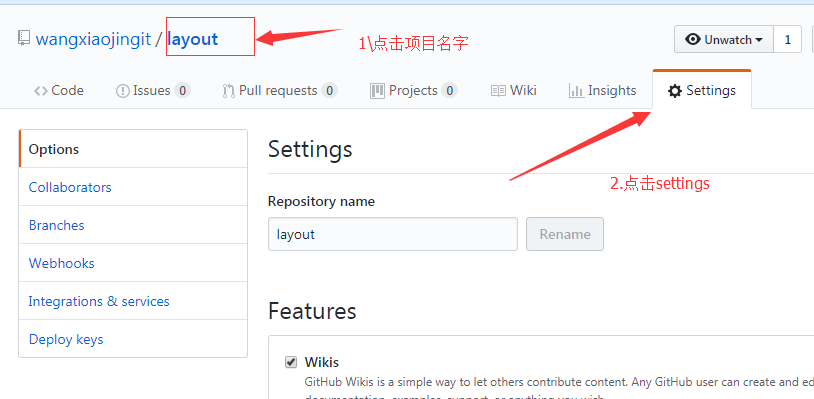
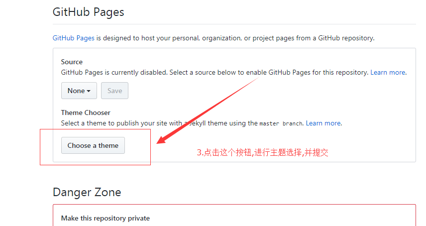
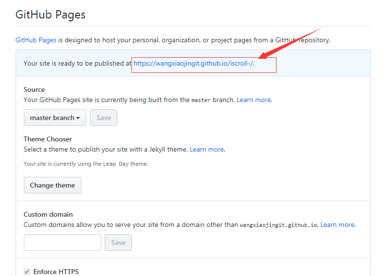
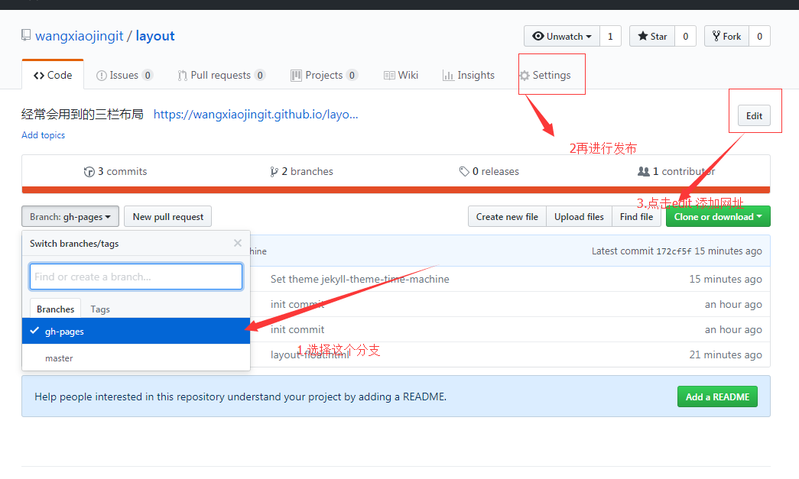

##git 界面操作之pull request
给别的仓库提交代码修改或者建议

-  把别人的仓库fork 一份,放到自己仓库下
- 平时我们可以修改自己仓库的源码,修改完提交到自己的仓库
- 由于自己仓库和fork的不一样,有一个pull request ,点击按钮,可以进行编辑,然后克隆的源仓库就可以看到.

静态网页的发布的两种方式:

> 方式一:在master上直接发布,这种不常用:方法如下
  1.创建一个项目仓库
  2.克隆这个仓库到本地
  3.把项目放到本地并推送到远程仓库
  4.点击github 上刚才推送的项目名字 

  
 

  
  5.便可以用上面的连接进行访问:https://wangxiaojingit.github.io/iscroll-/demo5.html

>  方式二:现在大部分采用的都是这个方式:
   
   `在master分支上提交源码,在gh-pages 上面新增一个说明页面,例如demo页面,并进行发布,供参阅者可以看到所做demo的效果`
   
  1. 创建仓库,并且克隆到本地,在master上放上源码,然后提交
  2. 在本地仓库上,创建分支,并切换到分支gh-pages上:git checkout -b gh-pages
  3. 2步骤切换之后,把demo.html添加到这个分支,并add/commit/push 到远程
  4.在自己的github 找到这个项目,切换到gh-pages的分支

  
  参阅者便可以通过这个链接来访问你写的效果.完结,希望大家可以通过这篇文章,学到github的发布方法,贡献自己的代码,一起学习,一起进步!